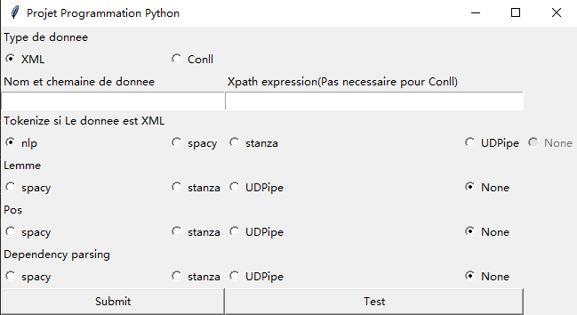

# Projet Programmation Python   -- WANG Mingtao / LUO Wei

## Introduction

Ce projet s'agit d'intégrer les résultats de différents analyseurs effectuant des chaînes de traitement variées (TOKENIZE, POS, LEMMA, DEPPARSE) dans un même fichier CoNLL-U. Dans ce projet, on utilise plusieurs outils de traitement du langage naturel tels que Spacy, UDipe, Stanza, HOPS etc. L'idée importante des algorithmes de ce projet consite à utiliser les outils à compléter les colonnes restes dans le fichier CoNLL-U. Dans ce cas, on utilise les structures essentilles de Python, les boucles, les branches etc pour les réaliser. Et la class main en tant que l'interface permet l'utilisateur à choisir l'outil qu'il veut prendre pour réaliser les tâches de tokenisation,lemmatisation,POS et l'analyse de dependency parsing.

## API
### class XmlToConll_U
Cette partie est dans le but de convertir le contenu d'un fichier Xml en format CoNLL-U. 

`tokenize_xml(xml_file, xpath_expression):` 
**-input**:fichier xml, xpath_expression 
**-output**:str en format CoNLL-U  
**Description**: Cette méthode est pour réaliser la transformation de xml à CoNLL-U. Dans ce processus, avant tout on utilise les outils de lxml et ntlk pour traiter le contenu du fichier xml, et puis générer et produire les résultats en format conllu. 

### class  MethodeDeSpacy
Dans cette classe, il existe les méthodes pour effectuer les tâches de tokeniser, lemmatiser, et de POS tagging pour les données textuelles françaises en utilisant la librairie _Spacy _ en Python. 

`def conllu_to_spacy(text):` 
**-input**: str 
**-output**: liste 
**Description**:Cette méthode a pour objectif de convertir le texte d'un fichier CoNLL-U en une liste _spacy_sentences_, qui contient des listes intérieures "chaque liste intérieure représente une phrase" contenant les mots.

`def spacy_to_conllu(spacy_sentences):` 
**-input**: liste   
**-output**:str 
**Description**: Cette méthode est justement à l'inverse de la méthode _conllu_to_spacy_. Il s'git de convertir une liste en les textes. 

`def tokenize_par_Spacy(xml_file,xpath_expression):` 
**-input**:xml fichier, xpath_expression 
**-output**: str en format CoNLL-U 
**Description**:Cette méthode consiste à tokeniser les textes à partir d'un fichier XML et les convertr en format CoNLL-U en utilisant les modèles des langues françaises de spacy. 

`def Lemme_par_Spacy(conllu_input:str):` 
**-input**:str 
**-output**:str 
**Description**:Il s'agit d'effectuer les tâches de _lemmatiser_. Et cela complète la troisième colonne de CoNLL-U. 

`def Pos_par_Spacy(conllu_text:str):` 
**-input**:str 
**-output**:str 
**Description**:Cette méthode consite à effectuer la tâche de _POS tagging_ et à complète la quatrième colonne de CoNLL-U. 

`def dependency_parsing_par_Spacy(conllu_text):` 
**-input**: str      
**-output**: str 
**Description**: Cela est utilisée pour réaliser la tâche de _Dependency parsing _ avec l'aide des modèles de langue française de spacy. 

### class MethodeDeStanza
Dans cette partie, l'idée principale consiste à effectuer des tâhces de tokeniser, lemmatiser, UPOS, et l'analyse dependency parsing en utilisant l'outil Stanza. Dans ce processus, il permet de convertir les textes entrés en sortie de format CoNLL-U.

`def tokenize_par_stanza(xml_file,xpath_expression):` 
**-input**: fichier xml, xpath_expression 
**-output**:tokens en format conllu_input (str) 
**Description**: Cette méthode effectue le processus de tokeniser. 

`def UPOS_par_Stanza(conllu_input):` 
**-input**: str  
**-output**: str  
**Description**: Il  s'agit de réaliser le travail de UOPS.

`def Lem_Par_Stanza(conllu_input):` 
**-input**: conllu_input (str)  
**-output**:conll_str (str)  
**Description**: Cette partie a pour objectif de faire la lemmatisation avce l'aide de Stanza. 

`def dependency_parsing_par_Stanza(conllu_input):` 
**-input**: conllu_input (str)  
**-output**:conll_str (str)  
**Description**: Dans cette méthode, cela nous permet d'effectuer l'analyse dependency parsing en utilisant Stanza. Néanmoins, avant de suivre cette étape, il est nécessaire d'avoir les données de POS pour continuer.

 ### class MethodeDeUDPipe
 Cette partie est également utilisée pour réaliser les travaux de tokeniser, lemmatiser et POS etc. Cependant, il permet aussi de réaliser les analyses de FEATS et DEPREL qui sont aussi importante en traitement du langage naturel. 

 `def tokenize(xml_file,xpath_expression):` 
 **-input**:fichier xml, xpath_expression 
 **-output**:conllu_output(str) 
 **Description**:Cette méthode permet de réaliser la tokenisation en utilisant les outils UDPipe et lxml. On import les modules, et après lire le fichier xml, générer le texte en token en format conllu. 

 `def UPOS_Par_UDPipe(conllu_input):` 
 **-input**:conllu_input(str) 
 **-output**:output_conll(str) 
 **Description**: Cette méthode consiste à effectuer la tâche de caractériser les catégories de tokens. 

 `def Lemme_Par_UDPipe(conllu_input):` 
 **-input**: str  
 **-output**: str  
 **Description**: Cela consiste à obtenir les résultats de lemmes des tokens en utilisant l'outil UDPipe. 

 `def Feats_Par_UDPipe(conllu_input):` 
 **-input**: str  
 **-output**:str  
 **Description**: Cette partie est utilisée pour obtenir les autres caractéristiques morphologies des tokens telles que le mode de temps, le nombre etc. 

 `def dependency_parsing_par_UDPipe(conllu_input):` 
 **-input**: str  
 **-output**: str  
 **Description**: Dans cette méthode, il s'agit d'obtenir les résultats des analyses dependency parsing.

 ### class main
 Cette partie joue un rôle d'interface avce l'utilisateur dans ce projet.

# Guide d'utilisation

Voici notre page principale. 
 
L'utilisateur doit sélectionner le type de données (actuellement pris en charge uniquement les fichiers XML et les fichiers texte au format Conll-U) dans "type de donnée". Ensuite, il doit saisir le chemin d'accès au fichier dans "Nom et chemin de données". S'il s'agit d'un fichier XML, il doit également saisir l'expression XPath. 

Ensuite, l'utilisateur peut choisir la méthode à utiliser pour manipuler les données, puis cliquer sur "submit" pour obtenir le fichier de sortie "resultat.txt", qui est au format texte Conll-U et contient les informations Conll des données d'entrée de l'utilisateur. Une fenêtre d'alerte s'affichera lorsque le programme aura terminé son exécution. 

(Dans la fonction "Tokenize", l'outil NLP peut ajouter "SpaceAfter" et "Offset" à la dixième colonne du format Conll-U.) 

Si l'utilisateur clique sur "test", une série de tests seront effectués en parcourant toutes les méthodes disponibles, et les résultats (ou les messages d'erreur) seront enregistrés dans le fichier "output.txt". (**Notez que pour le moment, seul les tests de fichiers XML sont supportés, veuillez ne pas utiliser de fichiers Conll pour les tests.**) 

Dans le fichier de résultat des tests "output.txt", nous utilisons des numéros pour représenter les différentes méthodes utilisées. Pour "Tokenize", 0 représente "NLP", 1 représente "Spacy", 2 représente "UDPipe" et 3 représente "Stanza". Pour les autres fonctions, 0 représente "Spacy", 1 représente "UDPipe" et 2 représente "Stanza". 

# Améliorations possibles
1. Lorsque l'utilisateur choisit le format Conll, le programme ne vérifie pas si le format choisi est approprié (c'est-à-dire s'il contient 9 séparateurs/t). 
2. Le programme s'exécute trop lentement. 
3. Si les informations Lemme et UPOS sont manquantes et que l'utilisateur choisit de réaliser une analyse de dépendance syntaxique, il est possible que cela provoque une erreur. 